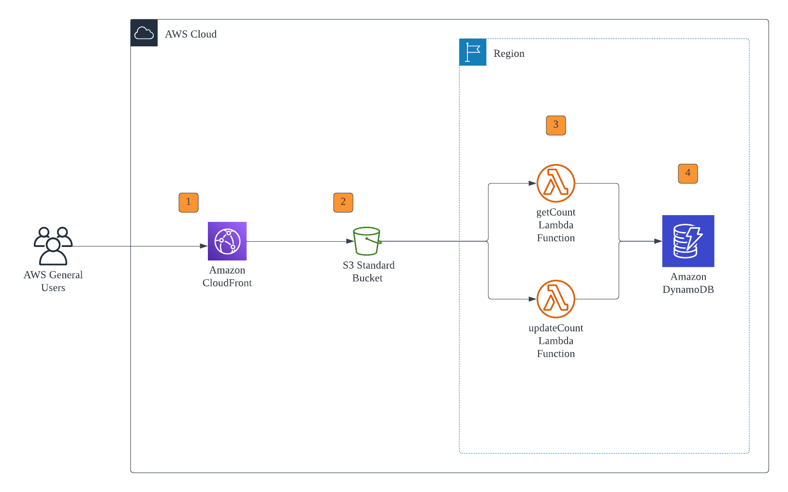

# MY CLOUD RESUME

## Overview
This project is a web application that showcases my resume, including my achievements, certifications, education and extracirricular roles. I will update it from time to time to reflect my current progress in my software development/engineering journey. <br><br>
It is currently hosted on AWS CloudFront: <br><a href="https://d1n0xcr7wbxfi0.cloudfront.net/index.html"> Click here to view </a> <br>(would be possible to use Route 53 but due to financial constraints, I will be sticking to CloudFront for now)

## Architecture


## Manual Deployment Process
### 1. Setting up S3 Bucket
1. First you can download the zip file of this git repository and unzip the folder OR git clone the repository onto your local machine
2. Create an S3 bucket and upload the extracted files onto the S3 bucket (all settings should remain at default)
3. Be sure to block all public access to S3 bucket (unless you want to do static website hosting using the S3 bucket)


### 2. Setting up DynamoDB
1. Create a DynamoDB Table
2. Set capacity mode to on-demand (or you can set provisioned mode at 5 RCU and 5 WCU)
3. Set partition key to "id" with data type as "S"
4. Create an item in the table with id = 1 and create new attribute "views" and set it to 0

### 3. Setting up Lambda Functions
1. Create a lambda function for getCount.py and updateCount.py, make sure to select Python 3.8 (or later) as runtime
2. Create environment variables for both lambda functions called TABLE_NAME and set TABLE_NAME = [dynamodb_table_name]
3. Enable lambda function URL, set AUTH_TYPE = None, and enable CORS, allow origin (*) for now
4. Copy and paste the lambda function URL into a .env folder and upload to S3 bucket
5. Configure Execution Role of Lambda functions to allow getItem and putItem onto your DynamoDB Table (otherwise you will receive a AccessDenied Error)

```
{
    "Version": "2012-10-17",
    "Statement": [
        {
            "Sid": "VisualEditor1",
            "Effect": "Allow",
            "Action": [
                "dynamodb:PutItem",
                "dynamodb:GetItem"
            ],
            "Resource": [
                "arn:aws:dynamodb:*:your_dynamodb_table_arn:table/*"
            ]
        }
    ]
}
```


### 4. Setting up CloudFront
1. Create CloudFront Distribution
2. Set origin to S3 Bucket that you have created
3. Set viewer protocol policy to HTTPS only
4. Disable WAF
5. Set default root object to index.html
6. Set S3 Bucket Policy

```
{
    "Version": "2008-10-17",
    "Id": "PolicyForCloudFrontPrivateContent",
    "Statement": [
        {
            "Sid": "AllowCloudFrontServicePrincipal",
            "Effect": "Allow",
            "Principal": {
                "Service": "cloudfront.amazonaws.com"
            },
            "Action": "s3:GetObject",
            "Resource": "arn:aws:s3:::your-bucket0name/*",
            "Condition": {
                "StringEquals": {
                    "AWS:SourceArn": "arn:aws:cloudfront::your_cloudfront_arn"
                }
            }
        }
    ]
}
```
7. Set CORS in Lambda function URL to only allow origin from the CloudFront Distribution